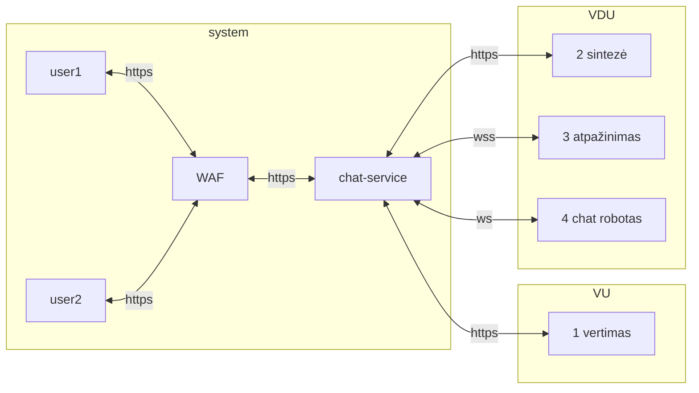

## Deploy

```mermaid
graph LR
    subgraph system
        user1[user1]
        user2[user2]
        waf[WAF]
        demo[chat-service]
    end
    subgraph VU[VU]
        tran[1 vertimas]
    end
    subgraph VDU[VDU]
        tts[2 sintezė]
        asr[3 atpažinimas]
        robo[4 chat robotas]
    end
    user1 <--> |https| waf
    user2 <--> |https| waf
    waf <--> |https| demo
    demo <--> |https| tran
    demo <--> |https| tts
    demo <--> |wss| asr
    demo <--> |ws| robo
```    