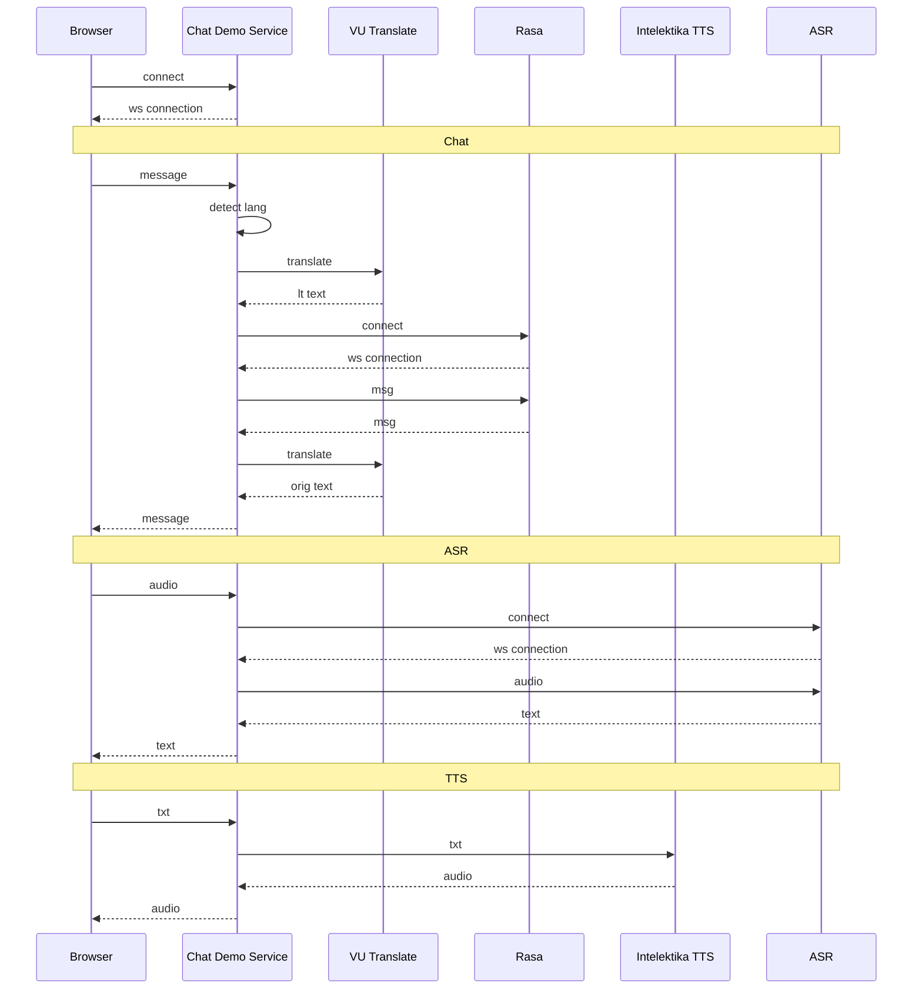

## Design

```mermaid
sequenceDiagram
    participant user as Browser
    participant srv as Chat Demo Service
    participant tra as VU Translate
    participant rasa as Rasa
    participant tts as Intelektika TTS
    participant asr as ASR
    user->>srv: connect
    srv-->>user: ws connection
    Note over user,asr: Chat
    user->>srv: message
    srv->>srv: detect lang
    srv->>tra: translate
    tra-->>srv: lt text
    srv->>rasa: connect
    rasa-->>srv: ws connection
    srv->>rasa: msg
    rasa-->>srv: msg
    srv->>tra: translate
    tra-->>srv: orig text
    srv-->>user: message

    Note over user,asr: ASR
    user->>srv: audio
    srv->>asr: connect
    asr-->>srv: ws connection
    srv->>asr: audio
    asr-->>srv: text
    srv-->>user: text
    
    Note over user,asr: TTS
    user->>srv: txt
    srv->>tts: txt
    tts-->>srv: audio
    srv-->>user: audio
```    